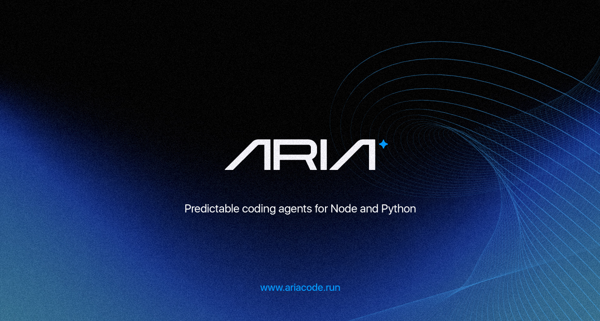

# @ariacode/cli

<p align="center">
  
</p>

[](https://nodejs.org)
[](./LICENSE)
[](https://github.com/ariacodeai/ariacode/actions)
[](https://www.npmjs.com/package/@ariacode/cli)

A predictable, terminal-native coding agent for Next.js, Nest.js, Prisma and Node.js projects.

Aria reads your repository, generates safe diffs with preview and tracks every mutation in a local SQLite history — no surprises.

## Requirements

- Node.js 20+
- `git` (for `review` command)
- `ripgrep` (for `search_code` tool — fast code search)

## Installation

```bash
npm install -g @ariacode/cli
```

After installation the `aria` binary is available globally.

## Quick Start

```bash
# Ask a question about your codebase
aria ask "How is authentication handled in this project?"

# Generate an implementation plan (read-only, no changes)
aria plan "Add rate limiting to the API routes"

# Preview a patch before applying
aria patch "Rename GeoPage to LandingPage" --dry-run

# Apply a patch with confirmation prompt
aria patch "Add error boundary to the root layout"

# Review staged git changes
aria review

# Explore an unfamiliar codebase
aria explore

# Check your environment
aria doctor
```

## Commands

### `aria ask <question>`

Ask a read-only question about the repository. The agent uses `read_file`, `list_directory`, and `search_code` to explore the codebase and answer your question.

```
aria ask "<question>" [--session <id>] [--max-tokens <n>] [--quiet]
```

| Flag | Description |
|------|-------------|
| `--session <id>` | Resume an existing session |
| `--max-tokens <n>` | Override max tokens for this response |
| `--quiet` | Suppress non-essential output |

### `aria plan <goal>`

Generate a structured implementation plan without making any changes. Returns steps, affected files, risks, and implementation notes.

```
aria plan "<goal>" [--session <id>] [--output <path>]
```

| Flag | Description |
|------|-------------|
| `--session <id>` | Resume an existing session |
| `--output <path>` | Save the plan as a markdown file |

### `aria patch <description>`

Analyze the repository, propose a unified diff, show a preview, and apply changes atomically after confirmation.

```
aria patch "<description>" [--dry-run] [--yes] [--session <id>]
```

| Flag | Description |
|------|-------------|
| `--dry-run` | Preview the diff without applying changes |
| `--yes` | Skip the confirmation prompt |
| `--session <id>` | Resume an existing session |

### `aria review`

Review git changes with AI assistance. Reads staged changes by default and returns a structured review with summary, issues, and suggestions.

```
aria review [--unstaged] [--branch <base>] [--format text|json]
```

| Flag | Description |
|------|-------------|
| `--unstaged` | Review unstaged changes instead of staged |
| `--branch <base>` | Compare current branch to a base branch |
| `--format json` | Output the review as JSON |

### `aria explore`

Scan the repository structure, detect frameworks and entry points, and summarize architectural patterns.

```
aria explore [--depth <n>] [--save]
```

| Flag | Description |
|------|-------------|
| `--depth <n>` | Limit directory traversal depth |
| `--save` | Save the summary to `./.aria/explore.md` |

### `aria history`

Inspect past sessions stored in the local SQLite database.

```
aria history [--limit <n>] [--session <id>] [--tree]
```

| Flag | Description |
|------|-------------|
| `--limit <n>` | Limit the number of sessions shown |
| `--session <id>` | Show the full log for a specific session |
| `--tree` | Render the tool execution tree |

### `aria config`

View and manage configuration.

```
aria config                        # Show effective config with sources
aria config get <key>              # Display a specific value
aria config set <key> <value>      # Write to ~/.aria/config.toml
aria config path                   # Show config file resolution paths
aria config init                   # Create ./.aria.toml with defaults
```

`config set` and `config init` support `--dry-run` and `--yes`.

### `aria doctor`

Run environment diagnostics: Node.js version, git, ripgrep, config validity, history DB, provider API keys, and project detection.

```
aria doctor [--format text|json]
```

## Configuration

Aria loads configuration from multiple sources in this precedence order (highest wins):

1. CLI flags
2. Environment variables
3. `./.aria.toml` (project-level)
4. `~/.aria/config.toml` (user-level)
5. Built-in defaults

### Configuration File Format

```toml
[provider]
default = "anthropic"       # anthropic | openai | ollama | openrouter
model = "claude-sonnet-4-6"
max_tokens = 4096

[agent]
max_iterations = 25
mode = "build"              # build | plan
timeout_seconds = 120

[safety]
require_confirm_for_shell = true
allowed_shell_commands = ["npm", "pnpm", "yarn", "npx", "git", "prisma", "tsc", "node"]
max_file_size_kb = 1024
max_files_per_patch = 50

[ui]
color = "auto"              # auto | always | never
quiet = false

[history]
retain_days = 90
```

Run `aria config init` to generate a `.aria.toml` in the current directory.

### Environment Variables

| Variable | Description |
|----------|-------------|
| `ANTHROPIC_API_KEY` | API key for Anthropic provider |
| `OPENAI_API_KEY` | API key for OpenAI provider |
| `OPENROUTER_API_KEY` | API key for OpenRouter provider |
| `ARIA_PROVIDER` | Override default provider |
| `ARIA_MODEL` | Override model name |
| `ARIA_MAX_TOKENS` | Override max tokens |
| `ARIA_MAX_ITERATIONS` | Override max agent iterations |
| `ARIA_TIMEOUT_SECONDS` | Override request timeout |
| `ARIA_COLOR` | Override color mode (`auto`/`always`/`never`) |
| `ARIA_QUIET` | Set to `true` to suppress non-essential output |
| `ARIA_RETAIN_DAYS` | Override session retention period |
| `DEBUG` | Set to `1` to show stack traces on errors |

## Providers

Aria supports four provider backends. Anthropic is the default. OpenRouter gives you access to virtually every hosted model from a single API key.

### Anthropic (default)

```bash
export ANTHROPIC_API_KEY=sk-ant-...
aria ask "What does this project do?"
```

| Model | ID |
|-------|----|
| Claude Opus 4.6 | `claude-opus-4-6` |
| Claude Sonnet 4.6 *(default)* | `claude-sonnet-4-6` |
| Claude Haiku 3.5 | `claude-haiku-3-5` |

### OpenAI

```bash
export OPENAI_API_KEY=sk-...
aria config set provider.default openai
aria config set provider.model gpt-4o
```

| Model | ID |
|-------|----|
| GPT-5 | `gpt-5` |
| GPT-5.1 | `gpt-5.1` |
| GPT-4o | `gpt-4o` |
| GPT-4o mini | `gpt-4o-mini` |
| o3 | `o3` |
| o4-mini | `o4-mini` |

### Ollama (local, no API key required)

Run any model locally — no API key needed.

```bash
# Pull a model first, then point Aria at it
ollama pull llama4
aria config set provider.default ollama
aria config set provider.model llama4
```

Popular models available via `ollama pull`:

| Model | ID |
|-------|----|
| Llama 4 | `llama4` |
| Llama 3.3 | `llama3.3` |
| Mistral | `mistral` |
| Qwen 2.5 Coder | `qwen2.5-coder` |
| DeepSeek Coder V2 | `deepseek-coder-v2` |
| Phi-4 | `phi4` |
| Gemma 3 | `gemma3` |

See the full list at [ollama.com/library](https://ollama.com/library).

### OpenRouter

Access hundreds of hosted models from a single API key — including Claude, GPT, Gemini, Mistral, DeepSeek, Qwen, MiniMax, and more.

```bash
export OPENROUTER_API_KEY=sk-or-...
aria config set provider.default openrouter
aria config set provider.model deepseek/deepseek-r1
```

**Anthropic via OpenRouter**

| Model | ID |
|-------|----|
| Claude Sonnet 4.5 | `anthropic/claude-sonnet-4-5` |
| Claude Opus 4 | `anthropic/claude-opus-4` |
| Claude Haiku 3.5 | `anthropic/claude-haiku-3-5` |

**OpenAI via OpenRouter**

| Model | ID |
|-------|----|
| GPT-5 | `openai/gpt-5` |
| GPT-5.1 | `openai/gpt-5.1` |
| GPT-4o | `openai/gpt-4o` |
| o3 | `openai/o3` |
| o4-mini | `openai/o4-mini` |

**Google via OpenRouter**

| Model | ID |
|-------|----|
| Gemini 3.1 Pro | `google/gemini-3.1-pro-preview` |
| Gemini 3.1 Flash | `google/gemini-3.1-flash-preview` |
| Gemini 2.5 Pro | `google/gemini-2.5-pro-preview` |
| Gemini 2.5 Flash | `google/gemini-2.5-flash-preview` |

**DeepSeek via OpenRouter**

| Model | ID |
|-------|----|
| DeepSeek R1 | `deepseek/deepseek-r1` |
| DeepSeek V3 | `deepseek/deepseek-chat` |
| DeepSeek Coder V2 | `deepseek/deepseek-coder` |

**Mistral via OpenRouter**

| Model | ID |
|-------|----|
| Mistral Large | `mistralai/mistral-large` |
| Mistral Small | `mistralai/mistral-small` |
| Codestral | `mistralai/codestral-2501` |

**Qwen via OpenRouter**

| Model | ID |
|-------|----|
| Qwen3 235B | `qwen/qwen3-235b-a22b` |
| Qwen2.5 Coder 32B | `qwen/qwen-2.5-coder-32b-instruct` |
| QwQ 32B | `qwen/qwq-32b` |

**Xiaomi MiMo via OpenRouter**

| Model | ID |
|-------|----|
| MiMo V2 Pro *(1T params, 1M ctx)* | `xiaomi/mimo-v2-pro` |
| MiMo V2 Omni *(multimodal)* | `xiaomi/mimo-v2-omni` |
| MiMo V2 Flash *(open-source, fast)* | `xiaomi/mimo-v2-flash` |

**MiniMax via OpenRouter**

| Model | ID |
|-------|----|
| MiniMax M1 | `minimax/minimax-m1` |
| MiniMax Text 01 | `minimax/minimax-01` |

**Meta via OpenRouter**

| Model | ID |
|-------|----|
| Llama 4 Maverick | `meta-llama/llama-4-maverick` |
| Llama 4 Scout | `meta-llama/llama-4-scout` |
| Llama 3.3 70B | `meta-llama/llama-3.3-70b-instruct` |

See the full model catalogue at [openrouter.ai/models](https://openrouter.ai/models).

## Exit Codes

| Code | Meaning |
|------|---------|
| `0` | Success |
| `1` | Generic error |
| `2` | Invalid arguments |
| `3` | Configuration error |
| `4` | Provider error (e.g. missing API key) |
| `5` | Project detection error |
| `130` | User cancelled (Ctrl+C or declined confirmation) |

## Session History

Every command execution is logged to `~/.aria/history.db` (SQLite). Sessions record messages, tool executions, and mutations. The database is created automatically on first run with permissions set to `600` (user-only).

View recent sessions:

```bash
aria history
aria history --limit 10
aria history --session <id>
aria history --session <id> --tree
```

Sessions older than `retain_days` (default: 90) are cleaned up automatically.

## Safety

- All file operations are validated against the project root — no writes outside the project directory
- Path traversal attempts (`../`) and symlink escapes are rejected
- Shell commands are restricted to an explicit allowlist
- `.env` files and `node_modules` are excluded from directory listings by default
- API keys are never logged to the history database or terminal output
- All mutations require confirmation unless `--yes` is passed

## Contributing

Contributions are welcome. Please open an issue or pull request at [github.com/ariacodeai/ariacode](https://github.com/ariacodeai/ariacode).

## License

MIT — see [LICENSE](./LICENSE)
